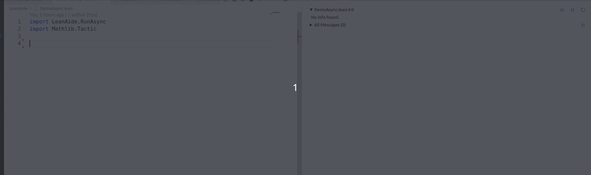
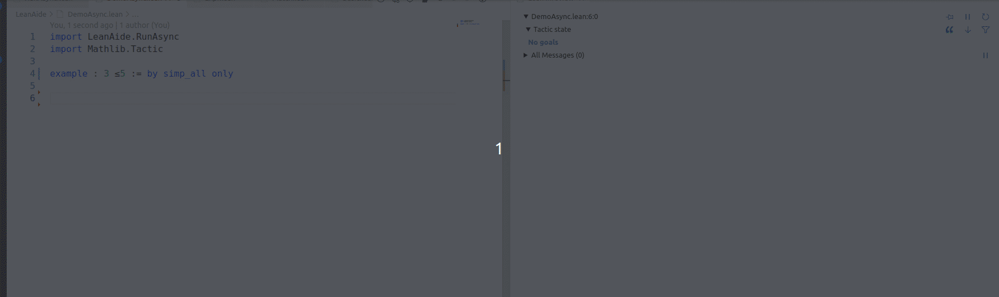
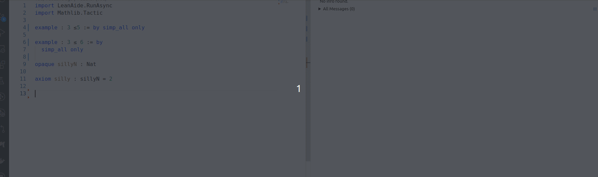
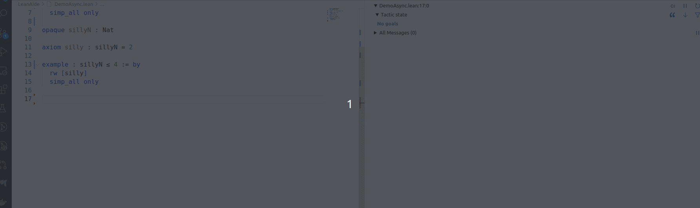
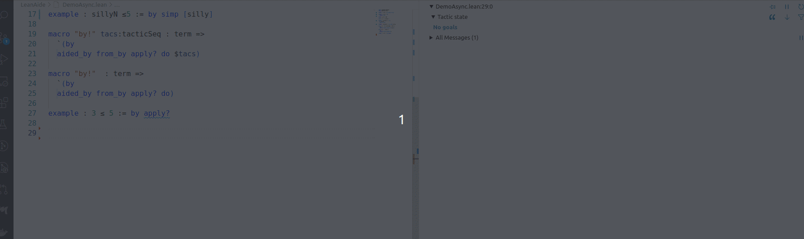
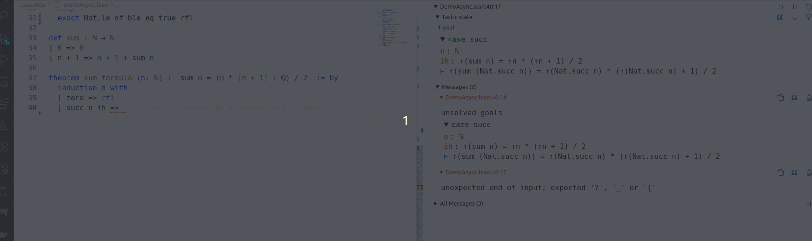

Thanks to the `TryThis` code and some code from the `say` tactic, using the Task framework here is a tool for running a tactic automatically in the background. By default this is `aesop?` but anything else can be used. The idea is to prove with a slightly different syntax: using `by#` in place of `by` with processes running in the background trying to complete the proof.

I am posting here for initial feedback but will PR to mathlib for detailed feedback soon.  @**Anand Rao Tadipatri** is working on something related.

## Easy proofs


If a proof is reasonably simple `aesop` will complete it. The `by#` notation is a macro for the more flexible notation:


## Proofs needing help

The following is introduced to make sure Aesop cannot solve automatically:

```lean
opaque sillyN : Nat

axiom silly : sillyN = 2
```

In the next two illustrations once we have given enough hints, the proof is completed. Note that for even a complete proof we need a code-action to make `by#` into `by` to be valid Lean syntax.





## Using other automation

In the next example we use `apply?` instead of `aesop?`. This is a little slower so does not finish within the builtin delay (50ms by default) but kicks in as we continue proving.



## Using tactics without "try this"

Both `aesop?` and `apply?` have a "Try this:" message which is intercepted and used. If a tactic is not such a search, then it is tried and the proof is completed when it is enough to finish. This is illustrated by using `linarith`.



This also illustrates a limitation: we do not look through induction, cases, match etc. An easy workaround is to have a macro and manually enter this mode.

## Continuing to run in the background

Tactics continuing to run in the background. If they finish successfully, the result is saved. A fresh elaboration with the same goal state and some stage triggers this.

The following gif illustrates this (by making delay 0).


When one runs by#, though the search is started there is no delay so it does not finish.
When skip is run, the elaborator goes through the tactics again, and this time sees the completed proof and offers a code action (again there is no delay, but the proof was ready).