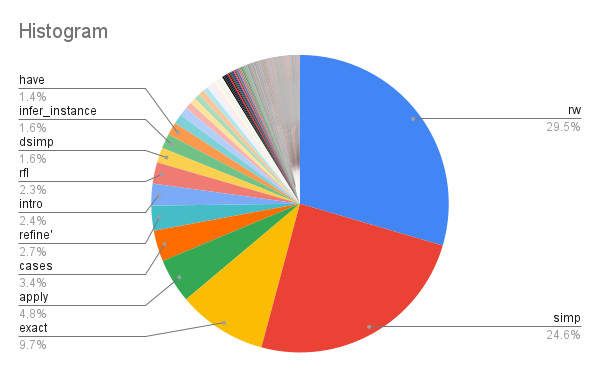

# Aesop

* Aesop (Automated Extensible Search for Obvious Proofs) is a proof search tactic for Lean 4.
* This does a (by default) best-first search for a proof of the goal based on a set of _rules_.
* The _rules_ are essentially tactics with some configuration, including a probability of success.
* A rule can be __safe__, in which case it is applied without backtracking.
* Besides being a proof search, Aesop handles two technical issues, which make using it much better than implementing our own version.
 
---

Aesop should be suitable for two main use cases (README):

- General-purpose automation, where Aesop is used to dispatch 'trivial' goals.
  Once mathlib is ported to Lean 4 and we have registered many lemmas as Aesop rules, Aesop will hopefully serve as a much more powerful `simp`.
- Special-purpose automation, where specific Aesop rule sets are built to address a certain class of goals. Tactics such as `measurability` `continuity` or `tidy`, which perform some sort of recursive search, can hopefully be replaced by Aesop rule sets.

---

* Our goal will be to build an Aesop rule set depending on the context.
* Some of the _rule builders_ in Aesop are:
  - `apply` : apply a theorem/function.
  - `simp` : simplify
  - `unfold` : unfold a definition
  - `forward` : forward reasoning
  - `tactic` : an arbitrary tactic
* The big gain is the ability to have many more theorems for `apply` and `simp`, making the task of the language model much easier.
* Some gain with rewrite: need not guess the order.

---

* The `simp` tactic, and also `Aesop`, attempt use every theorem with the `simp` attribute.
* In mathlib4 there are already over 7500 such theorems, so it is crucial that most are quickly ruled out.
* This is done using _Discrimination Trees_ (in Lean 4, going back at least to McCune '92) for fast (check for) unification.
* Aesop uses this for `apply` as well; there is also a brute force `suggest` tactic.
* For example, we can apply `Nat.le_step : ∀ {n m : ℕ}, n ≤ m → n ≤ Nat.succ m` only if the goal is of the form `_ ≤ Nat.succ _`; this can be quickly ruled out for most terms.

--- 

### Handling Metavariables

Rules which create metavariables must be handled specially by Aesop. For
example, suppose we register transitivity of `<` as an Aesop rule. Then we may
get a goal state of this form:

``` lean
n k : Nat
⊢ n < ?m

n k : Nat
⊢ ?m < k
```
--- 

We may now solve the first goal by applying different rules. We could, for example, apply the theorem `∀ n, n < n + 1`. We could also use an assumption `n < a`. Both proofs close the first goal, but crucially, they modify the second goal: in the first case, it becomes `n + 1 < k`; in the second case, `a < k`. And of course one of these could be provable while the other is not. 
In other words, the second subgoal now depends on the *proof* of the first subgoal (whereas usually we don't care *how* a goal was proven, only *that* it was proven). Aesop could also decide to work on the second subgoal first, in which case the situation is symmetric.

---

Due to this dependency, Aesop in effect treats the instantiations of the second subgoal as *additional goals*. Thus, when we apply the theorem `∀ n, n < n + 1`, which closes the first goal, Aesop realises that because this theorem was applied, we must now prove `n + 1 < k` as well. So it adds this goal as an additional subgoal of the rule application `∀ n, n < n + 1` (which otherwise would not have any subgoals). Similarly, when the assumption `n < a` is applied, its rule application gains an additional subgoal `a < k`.

--- 


* We can build a rule set with
  - tactics that finish/fail like `decide`, `rfl`, `linarith` as _normalization_ rules.
  - a large number of `simp`, `apply`, `unfold` etc rules from the language model plus some rule based.
  - a few tactic rules, especially rewrites.
* We need to directly predict from language models _intermediate lemmas_ and _instantiations_ (`have`, `let`, `use`, ...).
* Data for this comes not just from `have`/`let` statements but also statements of theorems/definitions used.
* If Aesop fails we need to use the trace to see partial progress to continue the proof search.

---


Clearly some tactics dominate.  The 13 tactics called at least 1% of the time account for 85% of the calls. Indeed the top 4 already account for nearly 70%.

Better still nice groups which inform strategy 

--- 

* **Theorem/term invoking tactics:** The tactics `rw`, `simp`, `exact`, `apply` and `dsimp` account for about 70% of the calls. These are tactics that apply in one way or the other one or more theorems, or in some cases terms (e.g. a particular instantiation of a theorem). 
* **Structure of goals/variables tactics:** The tactics  `induction`, `intro`,  `cases` are invoked when the goal, a variable in the local context, or sometimes a term built from the context, is of a special form. Generally one can algorithmically determine when to call these (as with some more tactics like `constructor`, `funext`).
* **Finish or fail:** Tactics `rfl`, `decide`, `assumption` as well as some powerful ones like `linarith` can be safely tried as they will just work or fail.

--- 
* **Intermediate goals:** The tactics `have` and `let` involve defining intermediate goals and useful terms.
* `refine` is used to make succinct proofs by skilled users (beyond my skill for example) and should be substituted by tactics of the above form.

The conclusion is what I anecdotally felt but with data to support but more importantly to show how to follow up: the key question to ask an ML system is *what theorems and terms to use* and then use rule based methods (or System 2 as @**Dipankar Ray** called it).